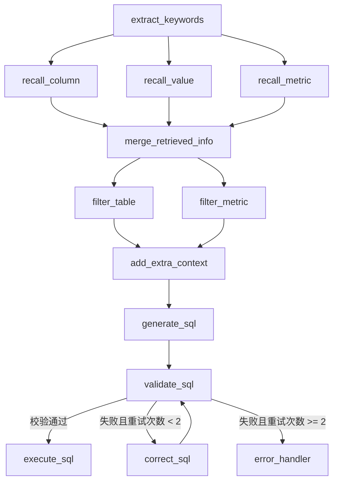

# Text-to-SQL 数据分析智能体

基于 LLM + 向量检索 + 全文搜索的自然语言转 SQL 数据分析系统。用户可以用中文提问，系统自动理解意图、检索数据库元知识、生成 SQL、校验执行，并通过 SSE 流式返回结果。

## 核心流程

```
用户提问（中文）
    ↓
① jieba 提取关键词
    ↓
② 三路并行召回（LLM 扩展关键词 → 检索）
   ├── 向量搜索 Qdrant → 匹配列元信息
   ├── 向量搜索 Qdrant → 匹配业务指标（GMV、AOV 等）
   └── 全文搜索 ES    → 匹配维度值（省份、产品名等）
    ↓
③ 合并召回结果，补充主外键，按表分组
    ↓
④ LLM 过滤，只保留与问题相关的表/列/指标
    ↓
⑤ 注入日期上下文 + MySQL 方言信息
    ↓
⑥ LLM（Qwen-coder）生成 SQL
    ↓
⑦ EXPLAIN 校验 → 失败则 LLM 自动纠错（最多重试 2 次）
    ↓
⑧ 执行 SQL，SSE 流式返回结果
```

## 技术栈

| 层 | 技术 |
|---|---|
| Web 框架 | FastAPI + SSE 流式响应 |
| Agent 编排 | LangGraph（状态图 + 条件边） |
| LLM | 阿里 DashScope（Qwen3-max 文本任务，Qwen-coder-plus 生成 SQL） |
| 向量搜索 | Qdrant（列/指标语义检索，1536 维） |
| 全文搜索 | Elasticsearch + IK 中文分词（维度值检索） |
| 关系数据库 | MySQL 8.0（元知识库 + 数据仓库） |
| NLP | jieba（中文分词 + TF-IDF 关键词提取） |
| Embedding | DashScope text-embedding-v2 |
| Python | 3.13+ |

## 项目结构

```
selfone/
├── main.py                              # FastAPI 入口
├── conf/
│   ├── app_config.yaml                  # 应用配置（DB、LLM、向量库等）
│   └── meta_config.yaml                 # 元知识定义（表、列、指标、维度值）
├── prompts/                             # LLM Prompt 模板（7 个）
├── app/
│   ├── api/
│   │   ├── routers/query_router.py      # POST /api/query 接口
│   │   ├── lifespan.py                  # 应用生命周期管理
│   │   └── dependencies.py              # 依赖注入
│   ├── agent/
│   │   ├── graph.py                     # LangGraph 状态图定义
│   │   ├── state.py                     # 状态定义（TypedDict）
│   │   ├── llm.py                       # LLM 初始化
│   │   └── nodes/                       # 各处理节点
│   │       ├── extract_keywords.py      # 关键词提取（jieba）
│   │       ├── recall_column.py         # 列元信息召回（Qdrant 向量搜索）
│   │       ├── recall_metric.py         # 指标召回（Qdrant 向量搜索）
│   │       ├── recall_value.py          # 维度值召回（ES 全文搜索）
│   │       ├── merge_retrieved_info.py  # 合并召回结果
│   │       ├── filter_table.py          # LLM 过滤相关表/列
│   │       ├── filter_metric.py         # LLM 过滤相关指标
│   │       ├── add_extra_context.py     # 注入日期/数据库上下文
│   │       ├── generate_sql.py          # SQL 生成
│   │       ├── validate_sql.py          # SQL 校验（EXPLAIN）
│   │       ├── correct_sql.py           # SQL 自动纠错
│   │       └── error_handler.py         # 错误处理
│   ├── clients/                         # 客户端管理
│   ├── repositories/                    # 数据访问层
│   ├── entities/ & models/              # 实体 & ORM 模型
│   ├── services/
│   │   ├── query_service.py             # 查询编排
│   │   └── meta_knowledge_service.py    # 元知识构建
│   └── scripts/
│       ├── build_meta_knowledge.py      # 元知识构建 CLI
│       └── evaluate_recall.py           # 召回评测脚本
├── docker/
│   ├── docker-compose.yaml              # 服务编排（MySQL、ES、Qdrant）
│   └── mysql/
│       ├── meta.sql                     # 元知识库 DDL
│       └── dw.sql                       # 数据仓库 DDL + 示例数据
└── evaluation_cases.json                # 28 个评测用例
```

## 数据仓库设计

采用星型模型，包含一个事实表和四个维度表：

| 表名 | 类型 | 说明 |
|---|---|---|
| `fact_order` | 事实表 | 订单事实表（2025 年 Q1 电商订单） |
| `dim_region` | 维度表 | 区域维度（6 个区域） |
| `dim_customer` | 维度表 | 客户维度（20 个客户） |
| `dim_product` | 维度表 | 产品维度（15 个产品） |
| `dim_date` | 维度表 | 日期维度 |

## 快速开始

### 1. 启动基础设施

```bash
cd docker
docker compose up -d
```

启动 MySQL 8.0、Elasticsearch（IK 分词）、Kibana、Qdrant。

### 2. 构建元知识库

```bash
python -m app.scripts.build_meta_knowledge -c conf/meta_config.yaml
```

读取 `meta_config.yaml`，将表/列/指标信息写入 MySQL 元知识库，并在 Qdrant 和 Elasticsearch 中建立索引。

### 3. 启动应用

```bash
uv run main.py
```

应用默认监听 `http://localhost:8000`。

### 4. 发送查询

```bash
curl -X POST http://localhost:8000/api/query \
  -H "Content-Type: application/json" \
  -d '{"query": "哪个省份的订单数最多？"}'
```

结果通过 SSE 流式返回。

## 配置说明

在 `conf/app_config.yaml` 中配置：

- **数据库连接**：MySQL 元知识库和数据仓库的连接信息
- **Qdrant**：向量数据库地址和 Collection 名称
- **Elasticsearch**：全文搜索引擎地址
- **Embedding 模型**：DashScope text-embedding-v2
- **LLM 配置**：
  - `llm_coder`：Qwen-coder-plus（SQL 生成）
  - `llm_text`：Qwen3-max（文本/JSON 任务）

## LangGraph 状态图



## License

MIT
